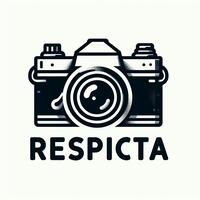

# Respicta - Image Resizer

<p align="center" width="100%">
     
</p>

Respicta is a versatile project offering a library, command-line interface (CLI), and web service for resizing images and changing their formats seamlessly.

## Features

**Resize Images**: Effortlessly resize images to desired dimensions.

**Change Format**: Convert images to different formats such as JPEG, PNG, etc.

**CLI**: Intuitive command-line interface for quick resizing and format conversion.

**Web Service**: Host a web service to resize images on-the-fly.

## Supported conversions 

- Gif to WebP
- Jpeg to WebP
- Png to Jpeg
- Png to WebP

## CLI

### Convert

```bash
docker run --rm -v ./:/images rayros/respicta convert --help
```

```plaintext
Convert images from one format to another

Usage: respicta convert [OPTIONS] <INPUT_PATH> <OUTPUT_PATH>

Arguments:
  <INPUT_PATH>   Input image path
  <OUTPUT_PATH>  Output image path

Options:
  -w, --width <WIDTH>      Width of the output image If not set, the width will be the same as the input image
  -h, --height <HEIGHT>    Height of the output image If not set, the height will be the same as the input image
  -q, --quality <QUALITY>  Quality of the output image. If not set, the quality will be the same as the input image. The value must be between 1 and 100. The higher the value, the better the quality
      --help               

Examples: 

respicta convert --width 100 --height 100 --quality 75 input.jpg output.jpg
```

### Server

```bash
docker run --rm rayros/respicta server --help
```

```plaintext
Start a server to convert images

Usage: respicta server [OPTIONS]

Options:
  -a, --address <ADDRESS>  Address to bind the server (default: 0.0.0.0:3000)
  -l, --limit <LIMIT>      Maximum file size in bytes (default: 10MB)
  -h, --help               Print help
```

#### Client example

```javascript
const fs = require('fs');
const { Readable } = require('stream');
const { finished } = require('stream/promises');

const filePath = './images/logo.jpeg';
const url = 'http://0.0.0.0:3000/?width=200&height=200&extension=jpeg';

fs.readFile(filePath, async (err, data) => {
    if (err) {
        console.error('Error reading file:', err);
        return;
    }

    const blob = new Blob([data], { type: 'image/jpeg' });

    const formData = new FormData();
    formData.append('file', blob, 'logo_small.jpeg');

    const response = await fetch(url, {
        method: 'POST',
        body: formData,
    })
    if (!response.ok) {
        const text = await response.text();
        console.error('Error:', text);
        return;
    }
    const fileWriteStream = fs.createWriteStream('./images/logo_small.jpeg');
    await finished(Readable.fromWeb(response.body).pipe(fileWriteStream));
});
```

### Command-server - send cli commands via http

```plaintext
Start a command server

Usage: respicta command-server [OPTIONS]

Options:
  -a, --address <ADDRESS>  Address to bind the server (default: 0.0.0.0:3000)
  -h, --help               Print help
```

#### Client example

```javascript
const run = async () => {
    const response = await fetch('http://0.0.0.0:3000/', {
        method: 'POST',
        body: JSON.stringify({
            input_path: './images/logo.jpeg',
            output_path: './images/logo_small.jpeg',
            width: 200,
            height: 200,
        }),
        headers: {
            'Content-Type': 'application/json',
        }
    })
    if (!response.ok) {
        const text = await response.text();
        console.error('Error:', text);
        return;
    }
};

run().catch(console.error);
```

### Postman client

[](https://app.getpostman.com/run-collection/1281512-ce9f3b4a-5c85-49d0-b794-97999b48a0c7?action=collection%2Ffork&source=rip_markdown&collection-url=entityId%3D1281512-ce9f3b4a-5c85-49d0-b794-97999b48a0c7%26entityType%3Dcollection%26workspaceId%3D1ee2b3bc-b936-48d7-b034-ff9b999f9ee5)

# As a library

```rust
use respicta::convert;

fn main() {
    convert(&respicta::Config::new(
        "images/logo.jpeg",
        "images/logo_small.jpeg",
        Some(200),
        Some(200),
    ))
    .unwrap();
}
```

# Docker compose

```yaml
version: '3.9'

services:
  respicta:
    image: rayros/respicta:latest
    restart: always
    command: command-server
    volumes:
      - ./data/respicta:/data

  main-app:
    build:
      context: .
      dockerfile: ./Dockerfile
    volumes:
      - ./data/respicta:/data
    restart: always
    environment:
      RESPICTA_HREF: http://respicta:3000
```

# Kubernetes

## Server deployment

How to use respicta inside pod for your custom resizer service.

```yaml
apiVersion: apps/v1
kind: Deployment
metadata:
  labels:
    app: my-resizer-service
  name: my-resizer-service
spec:
  replicas: 1
  selector:
    matchLabels:
      app: my-resizer-service
  template:
    metadata:
      labels:
        app: my-resizer-service
    spec:
      containers:
        - image: rayros/respicta
          name: respicta
          args: ["server", "--address", "0.0.0.0:4000"]
        - image: main-app-image:latest
          name: main-app
          ports:
            - containerPort: 2137
          env:
            - name: RESPICTA_HREF
              value: http://localhost:4000
```

## Command-server deployment

```yaml
apiVersion: apps/v1
kind: Deployment
metadata:
  labels:
    app: my-resizer-service
  name: my-resizer-service
spec:
  replicas: 1
  selector:
    matchLabels:
      app: my-resizer-service
  template:
    metadata:
      labels:
        app: my-resizer-service
    spec:
      containers:
        - image: rayros/respicta:latest
          name: respicta
          args: ["command-server", "--address", "0.0.0.0:4000"]
          volumeMounts:
            - name: data-volume
              mountPath: /data
        - image: main-app-image:latest
          name: main-app
          ports:
            - containerPort: 2137
          env:
            - name: RESPICTA_HREF
              value: http://localhost:4000
          volumeMounts:
            - name: data-volume
              mountPath: /data
      volumes:
        - name: data-volume
          persistentVolumeClaim:
            claimName: my-resizer-storage-pvc
```

---
<!-- TODO Article how to use respicta to get LQIP -->
<!-- TODO Add AVIF -->
<!-- TODO Add doc.rs link to readme -->
<!-- TODO Add nextest -->
<!-- TODO move Readme to code -->

##### Program utilized in:

- [mamrzeczy.pl - Free Classifieds in Poland](https://mamrzeczy.pl)
